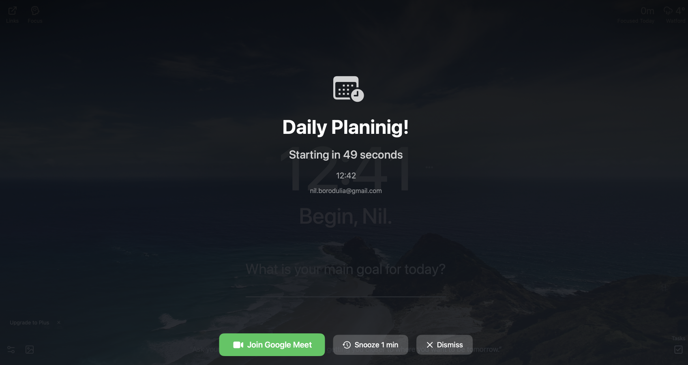
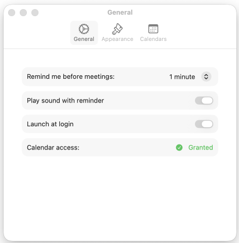
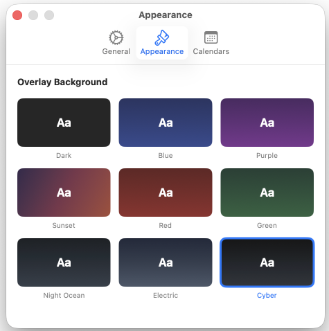
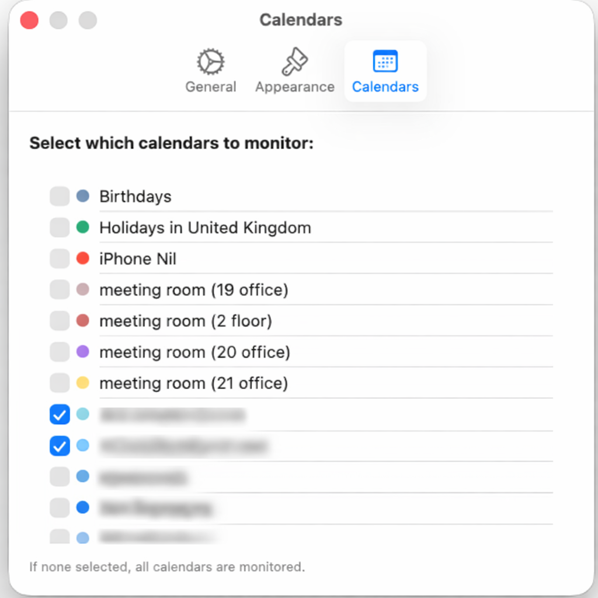

<p align="center">
  
</p>

<h1 align="center">Meeting Reminder for Mac</h1>

<p align="center">
A native macOS menu bar app that reads your calendar and displays a full-screen blocking overlay before meetings — so you never miss one. Detects video conference links (Zoom, Google Meet, Teams, Webex, Slack) and provides a one-click <strong>Join</strong> button.
</p>

<p align="center">
Inspired by <a href="https://www.inyourface.app">In Your Face</a>.
</p>

<p align="center">
  
</p>

## Features

- **Full-screen overlay** — appears on all screens at a configurable time before meetings (1 / 2 / 5 / 10 min)
- **Video link detection** — automatically finds Zoom, Google Meet, Microsoft Teams, Webex, and Slack Huddle links in event notes, URL, or location
- **One-click join** — press the Join button or hit Enter to open the meeting link
- **Snooze & dismiss** — snooze for 1 minute or dismiss with Escape
- **Menu bar app** — lives in the menu bar with no Dock icon; shows upcoming meetings at a glance
- **Multiple calendars** — works with iCloud, Google, Exchange, and any calendar synced to macOS; choose which calendars to monitor
- **Customizable backgrounds** — 9 overlay themes including Dark, Blue, Purple, Sunset, Night Ocean, Electric, and Cyber
- **Launch at login** — optional auto-start via macOS native API
- **Privacy-first** — all data stays on your Mac; uses Apple's EventKit with no third-party services

## Screenshots



<details>
<summary>Preferences</summary>

| General | Appearance | Calendars |
|---------|------------|-----------|
|  |  |  |

</details>

## Requirements

- macOS 13 Ventura or later
- Xcode 15+ (to build)
- Calendar access permission

## Installation

### Build from Source

```bash
git clone https://github.com/your-username/meeting-reminder.git
cd meeting-reminder
open MeetingReminder.xcodeproj
```

Then press **Cmd+R** in Xcode to build and run.

### Command Line Build

```bash
xcodebuild -project MeetingReminder.xcodeproj \
  -scheme MeetingReminder \
  -configuration Release build
```

The built app will be in `~/Library/Developer/Xcode/DerivedData/`.

## Usage

1. Launch the app — a calendar icon appears in the menu bar
2. Grant calendar access when prompted
3. The app monitors your events in the background
4. A full-screen overlay appears before your next meeting
5. Click **Join** to open the video call, **Snooze** to delay 1 minute, or **Dismiss** to close

## Configuration

Open **Preferences** from the menu bar dropdown:

| Setting | Options | Default |
|---------|---------|---------|
| Reminder time | 1 / 2 / 5 / 10 minutes before | 5 minutes |
| Sound | On / Off | On |
| Background | Dark, Blue, Purple, Sunset, Red, Green, Night Ocean, Electric, Cyber | Dark |
| Calendars | Select which calendars to monitor | All |
| Launch at login | On / Off | Off |

## Project Structure

```
MeetingReminder/
├── MeetingReminderApp.swift          # App entry point with MenuBarExtra
├── Models/
│   └── MeetingEvent.swift            # Meeting data model
├── Services/
│   ├── CalendarService.swift         # EventKit integration
│   ├── MeetingMonitor.swift          # Timer-based meeting scheduler
│   └── VideoLinkDetector.swift       # Conference URL parser (regex)
├── Views/
│   ├── MenuBarView.swift             # Menu bar dropdown
│   ├── OverlayWindow.swift           # NSPanel wrapper (covers all screens)
│   ├── OverlayView.swift             # Full-screen overlay UI
│   └── SettingsView.swift            # Preferences window
├── Resources/
│   └── Assets.xcassets               # App icon
├── Info.plist
└── MeetingReminder.entitlements
```

## Supported Video Platforms

| Platform | URL Pattern |
|----------|-------------|
| Zoom | `zoom.us/j/...` |
| Google Meet | `meet.google.com/...` |
| Microsoft Teams | `teams.microsoft.com/l/meetup-join/...` |
| Webex | `*.webex.com/...` |
| Slack Huddle | `app.slack.com/huddle/...` |

Links are detected in the event's URL, notes, and location fields.

## License

MIT
